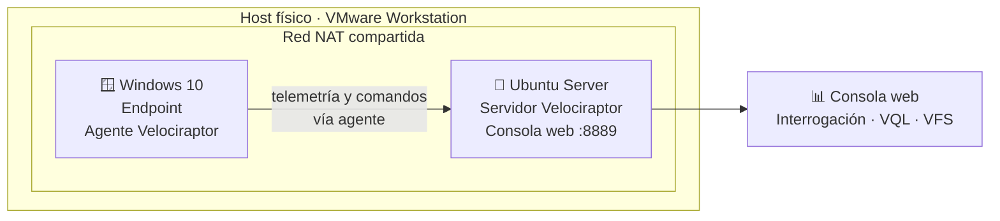
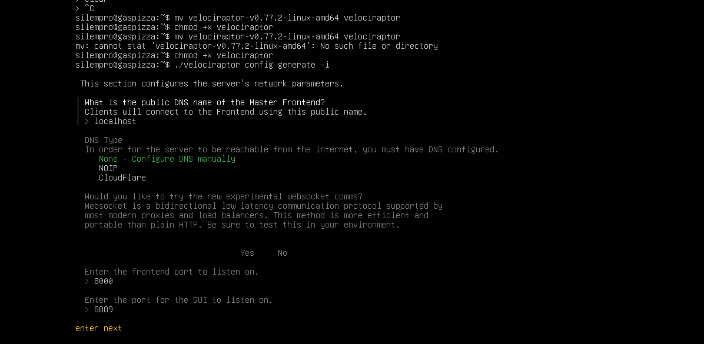
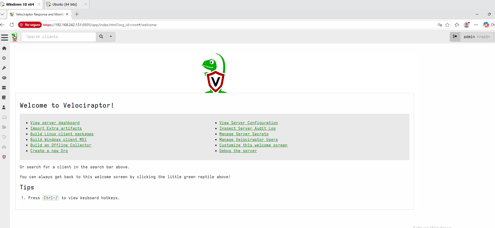
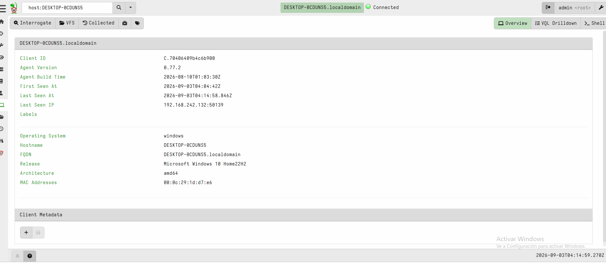
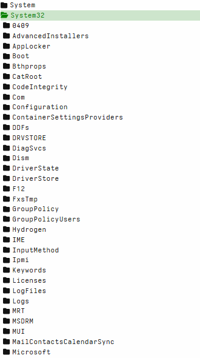
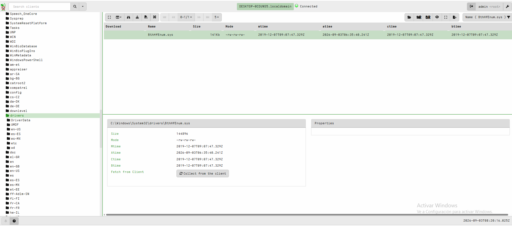
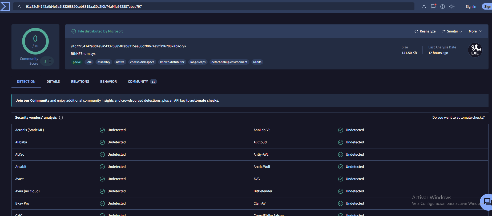
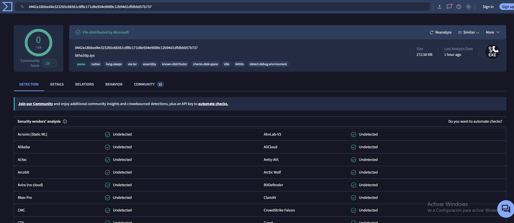
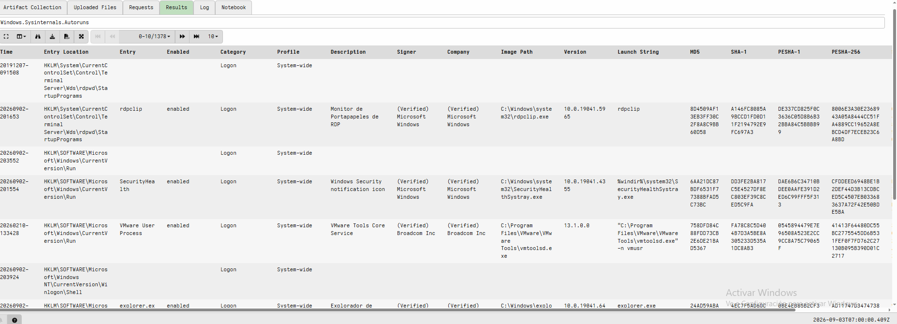

# 🦖 Laboratorio EDR con Velociraptor

Proyecto personal de práctica en ciberseguridad (Blue Team): despliegue, configuración y exploración de las funciones principales de **Velociraptor**, una herramienta EDR/DFIR open source, sobre un endpoint Windows dentro de un laboratorio virtualizado.

Este proyecto complementa un laboratorio previo de **SIEM (Wazuh) + Honeypot**, avanzando hacia la capa de visibilidad y respuesta a nivel de endpoint.

---

## 📋 Tabla de contenidos

- [Objetivo](#-objetivo)
- [Arquitectura](#️-arquitectura)
- [Herramientas y tecnologías](#️-herramientas-y-tecnologías)
- [Funciones exploradas](#-funciones-exploradas)
- [Hallazgo destacado](#-hallazgo-destacado)
- [Informe completo](#-informe-completo)
- [Capturas](#-capturas)
- [Aprendizajes](#-aprendizajes)
- [Próximos pasos](#-próximos-pasos)
- [Disclaimer](#️-disclaimer)

---

## 📌 Objetivo

Familiarizarme de forma práctica con una herramienta EDR real, replicando el flujo de trabajo de un analista: detectar, investigar, recolectar evidencia y verificar hallazgos — todo documentado como parte de un portafolio orientado a roles junior de seguridad.

---

## 🏗️ Arquitectura

- **Servidor:** Ubuntu Server, aloja la consola web y coordina las colecciones.
- **Endpoint:** Windows 10, con el agente instalado como servicio.
- **Red:** NAT compartida en VMware Workstation.

---

## 🛠️ Herramientas y tecnologías

`Velociraptor v0.77.2` · `VMware Workstation` · `Ubuntu Server` · `Windows 10` · `VQL` · `Sysinternals Autoruns` · `VirusTotal`

---

## 🔍 Funciones exploradas

| # | Función | Descripción |
|---|---------|-------------|
| 1 | Interrogación de host | Visibilidad pasiva del endpoint (SO, IP, MAC, fechas de conexión) |
| 2 | Consultas VQL en vivo | `SELECT * FROM pslist()` — procesos en tiempo real |
| 3 | Detección de persistencia | Artifact `Windows.Sysinternals.Autoruns` + técnica de *stacking* |
| 4 | Respuesta / recolección forense | Módulo VFS — extracción de un archivo del endpoint sin ejecutarlo |

---

## 📊 Hallazgo destacado

Durante el análisis de persistencia (1378 entradas), se aislaron mediante *stacking* dos entradas marcadas como `(Not Verified) Microsoft Corporation` (drivers de Bluetooth). Se investigó el contexto, se recolectó una copia forense vía VFS, y se verificaron los hashes SHA-256 en VirusTotal (0/70 y 0/64 detecciones, sello *"File distributed by Microsoft"*), confirmando que se trataba de un **falso positivo**.

Este hallazgo documenta el ciclo completo de triage: **detección → investigación → recolección → verificación externa**.

---

## 📄 Informe completo

El detalle completo del proyecto, ordenado de principio a fin con los conceptos clave explicados, está en:
👉 [`docs/informe-tecnico.pdf`](./docs/informe-tecnico.pdf)

---

## 📸 Capturas

*(Estos son los nombres que vamos a usar — cuando me pases las capturas reales, te digo cuál va con cada nombre, igual que hicimos con el lab de SIEM.)*

---

## 🧠 Aprendizajes

- Instalación y configuración de un EDR real (Velociraptor) en modo servidor/agente.
- Uso de VQL (Velociraptor Query Language) para consultas en vivo sobre el endpoint.
- Técnica de *stacking* para reducir ruido en un análisis de persistencia (de 1378 entradas a 2 sospechosas).
- Recolección forense de evidencia sin alterar ni ejecutar el archivo original.
- Verificación cruzada de hallazgos contra fuentes de threat intelligence externas (VirusTotal) antes de sacar conclusiones.
- Diferencia práctica entre "indicador sospechoso" y "confirmación de amenaza", y el valor de descartar falsos positivos con evidencia, no con intuición.

---

## 🚀 Próximos pasos

- [ ] Integrar esta telemetría con el SIEM (Wazuh) del laboratorio anterior → enfoque **XDR**
- [ ] Simular ataques reales con **Atomic Red Team**, mapeados a **MITRE ATT&CK**
- [ ] Automatizar el enriquecimiento de hallazgos (mini-SOAR con Python + VirusTotal API)

---

## ⚠️ Disclaimer

Laboratorio educativo, realizado en un entorno completamente aislado y virtualizado, sin fines de producción.

---

📫 *Proyecto realizado como parte de mi portafolio personal de ciberseguridad.*
